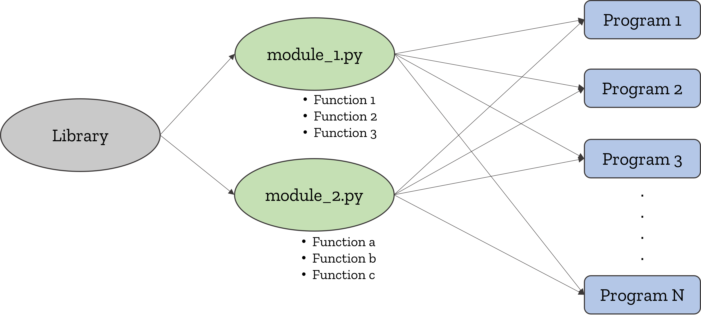

# A Little about Library, Module & Function

Simply put, **module** is a file containing *python code*. for example, `example.py` is a module named "example". Modules can contain ***functions, classes, or variables.*** As mentioned earlier, making modules makes it easier to *debug* if any *bugs* arise in the future and also make *main scripts / programs* become neater.



Imagine if you make 100 programs in which you have to plot the epicenter of an earthquake. then you create a plot_epicenter function as below in each of the 100 programs.

```python
def plot_epicenter(x, y):
    """
    plot earthquake epicenter

    Parameters:
    -----------
    x, y : {float or array-like} The data positions with shape (n, ).    
    
    Returns:
    -----------
    fig : {matplotlib.figure object} 
    """
    
    fig, ax = plt.subplots()
    ax.scatter(x, y, c='r', edgecolors = 'k', alpha=0.8)
    ax.set(title='earthquake epicenter')
    fig.show()
    
    return fig
```

then one day you are asked to change the color of the earthquake epicenter plot to blue. Your hands will be curly changing all `c='r'` to `c='b'` in each function of those 100 programs. However, if you create a module containing the earthquake plot_epicenter function and you *import* that function in all 100 of your programs, then you only need to replace one `c='r'` to `c='b'` in your module. Automatically all epicenter plots in your 100 programs will be changed to blue. Especially if you make many of the same functions for the 100 programs and in some certain functions there is an error. it would be a disaster!